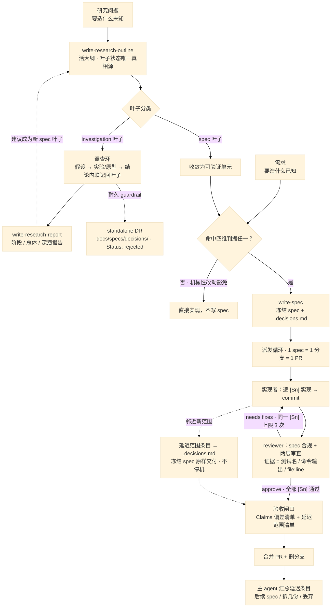
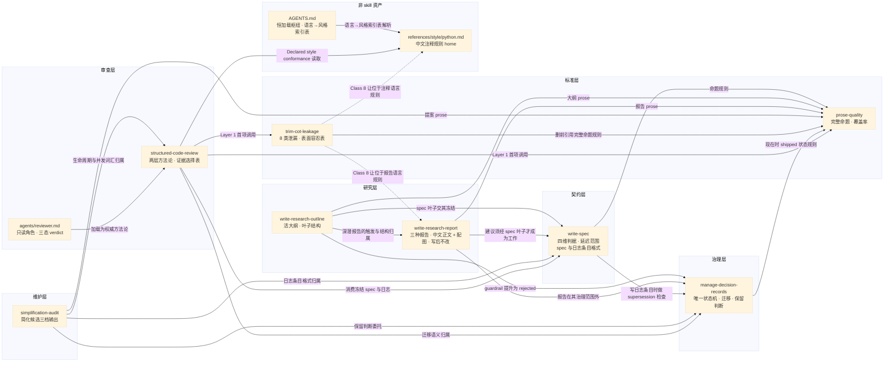

# Spec-Loop Skill 仓库

这是我自己的跨设备、跨 harness 工作流恢复仓库：承载 spec-loop（规格驱动）工程方法论与评审 agent。

## 这是什么

Spec-loop engineering 的核心：凡命中触发判据的任务——改对外契约、跨 2+ 模块不可单元回滚、无人值守执行、需先做取舍决策——都先冻结一份带 `[Sn]` 章节、Claims、`Global Constraints` 与 `Out of Scope` 的 spec，再按派发循环实现、由评审 agent 验收。方法论是 **harness 无关**的：凡能派发 subagent 的 harness 都能直接执行。

## 目录结构

```
├── AGENTS.md            # 全局规则与 skill 调用指南（主循环、派发参数、门禁、协作）
├── agents/
│   └── reviewer.md      # 严格评审 agent（只读；方法论指针 → structured-code-review；含 spec 合规程序）
├── docs/
│   └── decisions/       # 本仓库自身的工作流治理决策记录（不随安装拷贝）
├── references/
│   └── style/
│       └── python.md    # Python 风格文档（Google Python 改编 + 注释中文团队规则）
├── skills/              # 八个 skill，每个目录一个 skill（SKILL.md）
│   ├── write-research-outline/
│   ├── write-research-report/
│   ├── write-spec/
│   ├── prose-quality/
│   ├── structured-code-review/
│   ├── manage-decision-records/
│   ├── trim-cot-leakage/
│   └── simplification-audit/
```

## 恢复到新设备 / 新 harness

Kimi Code：skill 装到 `~/.kimi-code/skills/`、agent 装到 `~/.kimi-code/agents/`、全局规则在 `~/.kimi-code/AGENTS.md`。按目录对应拷贝：

```sh
mkdir -p ~/.kimi-code/skills ~/.kimi-code/agents ~/.kimi-code/references
cp -r skills/*     ~/.kimi-code/skills/
cp agents/*        ~/.kimi-code/agents/
cp AGENTS.md       ~/.kimi-code/AGENTS.md
cp -r references/* ~/.kimi-code/references/
```

维护要点：

- **每次改动 `skills/`、`agents/`、`AGENTS.md` 或 `references/` 后都要重跑拷贝**——仓库是唯一权威，本机安装只是镜像。
- `cp -r skills/*` 只增不删：先删除 `~/.kimi-code/skills/` 里已废弃的 skill 目录再拷贝。
- `cp AGENTS.md ~/.kimi-code/AGENTS.md` 覆盖本机全局规则：覆盖前先 `diff` 确认无本地定制。
- 安装后校验 `~/.kimi-code/` 镜像：skill 目录计数为 8、关键文件非空：

```sh
n=$(find ~/.kimi-code/skills -mindepth 1 -maxdepth 1 -type d 2>/dev/null | wc -l); [ "$n" -eq 8 ] || echo "skill count: $n, expected 8"
for s in ~/.kimi-code/skills/*/; do [ -s "$s/SKILL.md" ] || echo "missing: $s/SKILL.md"; done
[ -s ~/.kimi-code/references/style/python.md ] || echo "missing: references/style/python.md"
```

- `docs/` 是本仓库自己的治理记录，不随安装拷贝。

### Mimo Code

恢复方式：skill 目录原样拷贝进 `~/.config/mimocode/skills/`（mimocode.jsonc 的 `skills.paths` 需包含该目录）；`agents/` 下的 agent 前端是 harness 相关（本仓库按 kimi 格式书写），需翻译成 mimo 格式放进 `~/.config/mimocode/agent/`；AGENTS.md 按需同步（见下）。skill 与 agent 的改动下一轮热重载生效，用 `mimo agent list` 校验。

同步 skill（原样覆盖，只增不删）：

```sh
for s in skills/*/; do
  n=$(basename "$s")
  mkdir -p ~/.config/mimocode/skills/"$n"
  cp -r "$s/." ~/.config/mimocode/skills/"$n"/
done
```

维护要点：

- **只增不删**：mimo 全局 skills 目录里可能还有本仓库之外的 skill，禁止删除整个目录或用 `--delete` 同步；只清理本仓库中已废弃的 skill 目录。
- skill 正文是 harness 无关的纯方法论，原样覆盖即可，无需按 mimo 改写。

适配 agent（每次改动 `agents/` 后都要重翻译）：

| 本仓库（kimi） | mimo | 翻译规则 |
|---|---|---|
| 文件名（如 `agents/reviewer.md`） | `~/.config/mimocode/agent/<name>.md` | `mode: subagent`；正文即 persona/system prompt |
| `description` + `whenToUse` | `description` | 合并为触发条件，改中文 |
| `tools` / `disallowedTools` | `permission` | 只读 agent：`write`/`edit` deny，`bash` `"*"` deny + git 只读白名单（`git diff/log/show/status/rev-parse *` allow） |
| `model` | `model` | reviewer 档 ≥ implementer 档；`temperature: 0.2` |
| 正文 | 正文 | 同一角色语义改写：只读薄角色 + 委托 `structured-code-review` + 加载 `prose-quality`/`trim-cot-leakage` 做 prose pass + spec 合规程序 + 三态 verdict |

AGENTS.md：若需全局同步，先 `diff` 仓库版与 `~/.config/mimocode/AGENTS.md`；mimo 版如有本地定制（如 compose 接线、个人 skill 条目），只对齐其中引用的 skill 注册表，不整文件覆盖。

校验：

```sh
mimo agent list                    # 已翻译的 agent 以 (subagent) 出现
for s in skills/*/; do diff -q "$s/SKILL.md" ~/.config/mimocode/skills/$(basename "$s")/SKILL.md; done
```

其他 harness：把 `skills/*/SKILL.md` 的方法与 `agents/*` 的提示词装到各自约定位置。技能正文是 harness-agnostic 方法论；只有前端 `type: prompt`、`whenToUse` 与 `agents/` 是 harness 相关，可按需改写。

## 工作流速览



研究课题：研究问题 → `write-research-outline`（活大纲 + 叶子分类）→ spec 叶子冻结 / investigation 叶子走调查循环；叶子结局内联记在大纲，耐久 guardrail 提升为 standalone DR；阶段报告 / 总体报告 / 深潜报告三种时点交付物由 `write-research-report` 规定、主 agent 撰写；报告正文用中文书写并附可视化图片（规则见该 skill）。

功能开发：requirements → `write-spec`（冻结纯契约 spec：`[Sn]`+Claims+`Global Constraints`+`Out of Scope`；`Dependencies` 可选）→ 派发循环（每 `[Sn]` 实现/commit/review）→ 对照 spec 验收。全部设计决策（brainstorm 起）直接进 `<slug>.decisions.md`（含 `## Progress` 进度表）；跨 feature/跨 spec 的耐久决策进 standalone DR（`docs/specs/decisions/`）。实现期发现的邻近新范围记为延迟范围条目（`.decisions.md`），冻结 spec 原样交付，合并后由主 agent 汇总处置（细则见 `write-spec`）。prose 与推理泄漏审查由 `prose-quality` + `trim-cot-leakage` 承担；简化用 `simplification-audit`；GitHub Flow 约定见 `AGENTS.md`。

## Skill 协作



- 标准层对每个产出文案的 skill 同时生效，图中只画到 `prose-quality` 的边：`trim-cot-leakage` 经 `prose-quality` 的 corpus audit 与 `structured-code-review` 的 Layer 1 #1 作用于同一批表面，不为每个产出者重复画。
- 风格规则归风格文档所有，别处只引用不复述；它与 `trim-cot-leakage` Class 8 冲突时的优先级裁决归该 skill 的 Class 8 修复规则。
- 协作声明落盘：`AGENTS.md`（调用指南）+ 各 `SKILL.md` 的 `## Collaboration` 节 + `agents/reviewer.md` + 本文件（协作总图）。
